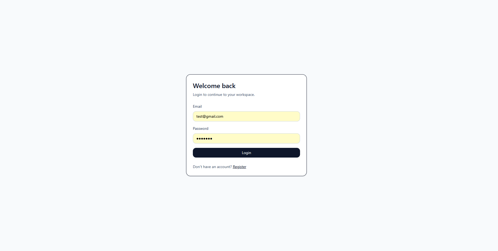
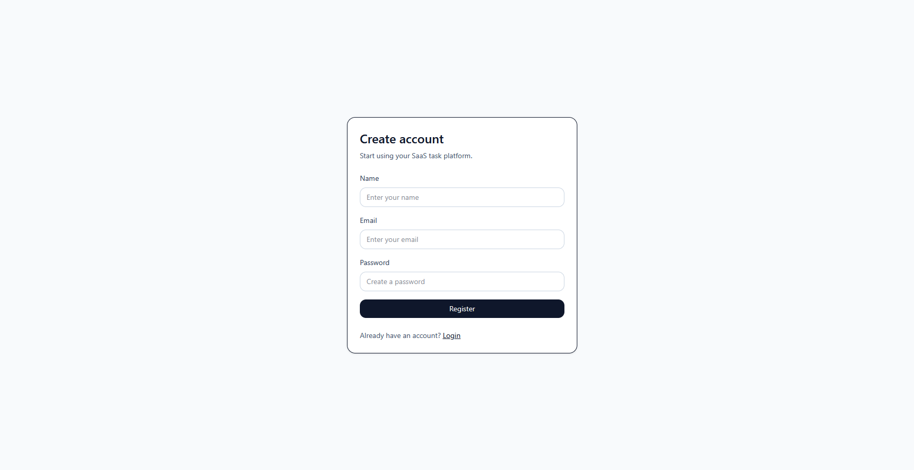
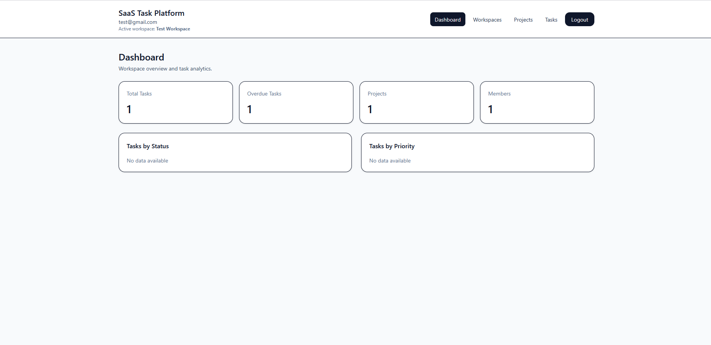
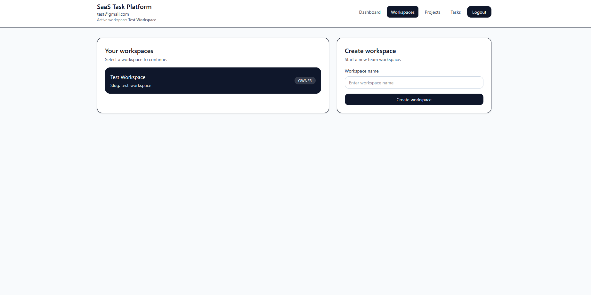
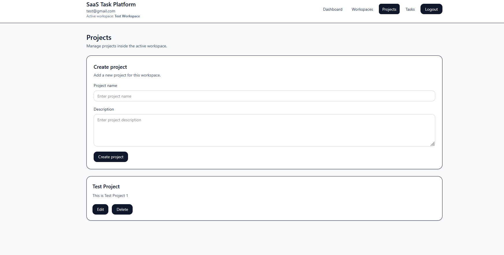
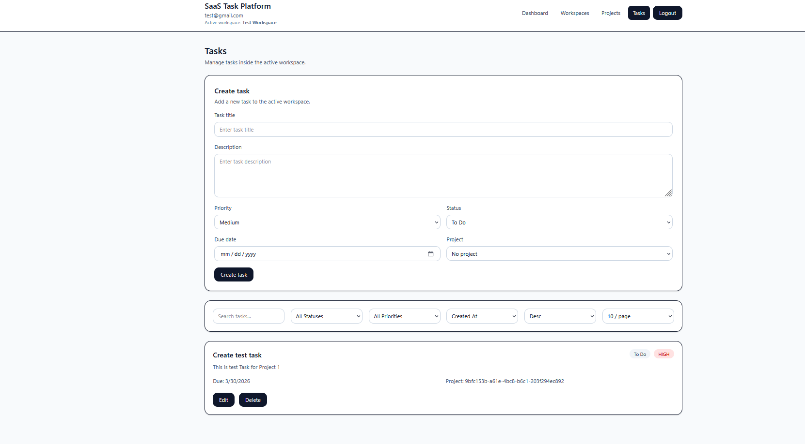
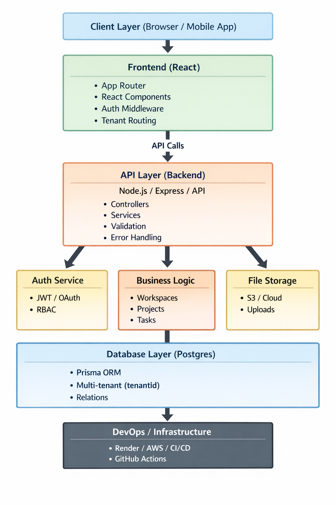
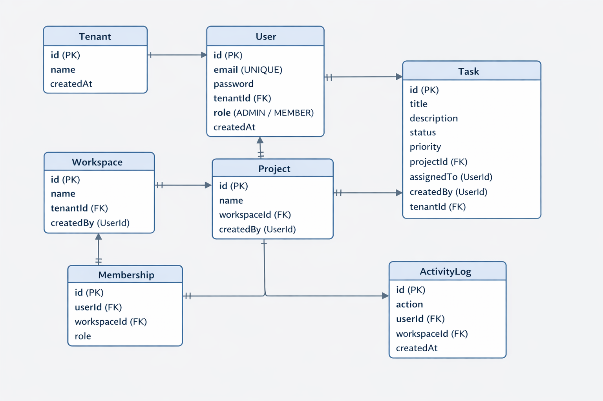

# 🚀 Full-Stack SaaS Task Management Platform

> Production-ready multi-tenant SaaS application — built like a real product, not a tutorial.

[](https://full-stack-saas-platform-k25wchnoc-ashrafakib02s-projects.vercel.app)
[](https://full-stack-saas-platform.onrender.com)
[](https://nodejs.org)
[](https://www.postgresql.org)
[](https://reactjs.org)
[](LICENSE)

---

## 🌐 Live Links

| Service | URL |
|---|---|
| Frontend | [full-stack-saas-platform.vercel.app](https://full-stack-saas-platform-k25wchnoc-ashrafakib02s-projects.vercel.app) |
| Backend API | [full-stack-saas-platform.onrender.com](https://full-stack-saas-platform.onrender.com) |
| Health Check | [/api/v1/health](https://full-stack-saas-platform.onrender.com/api/v1/health) |

---

## 🎬 Demo


---

## 📸 Screenshots

### Authentication



### Dashboard & Workspaces





### Architecture & Schema



---

## 🧠 What Problem This Solves

Real SaaS products need more than CRUD — they need **workspace isolation, role-based access, audit logging, and analytics**. This project solves exactly that:

- **Multi-tenancy** — workspace-level data isolation between organizations
- **Role-based access control** — Owner / Admin / Member permissions
- **Centralized analytics** — real-time task and project dashboards
- **Audit trail** — full activity logging across workspaces
- **Scalable querying** — search, filter, sort, and paginate at the API level

Built across 3.5+ years of full-stack engineering experience on government, SaaS, and enterprise systems in Bangladesh, India, and Sri Lanka.

---

## ⚡ Features

- JWT authentication with protected routes
- Multi-tenant workspace architecture
- Role-based access (Owner / Admin / Member)
- Project management scoped to workspaces
- Task system with status, priority, and due dates
- Search, filtering, sorting, and pagination
- Dashboard analytics (tasks, projects, members)
- Activity logging (audit-ready)
- RTK Query for caching and data fetching
- Full-stack deployment with CI/CD

---

## 🛠️ Tech Stack

### Backend
| Tech | Purpose |
|---|---|
| Node.js + Express | API server |
| PostgreSQL | Primary database |
| Prisma ORM | Type-safe database access |
| JWT | Authentication |
| Winston | Structured logging |

### Frontend
| Tech | Purpose |
|---|---|
| React (Vite) | UI framework |
| Redux Toolkit + RTK Query | State + data fetching |
| React Hook Form | Form handling |
| Tailwind CSS | Styling |

### DevOps
| Tech | Purpose |
|---|---|
| Render | Backend hosting |
| Vercel | Frontend hosting |
| GitHub Actions | CI/CD pipeline |

---

## 🧱 System Architecture

```
Client (React + RTK Query)
        ↓
API Layer (Express)
        ↓
Modules (Auth / Workspace / Project / Task / Dashboard)
        ↓
Prisma ORM
        ↓
PostgreSQL
```

- Feature-based modular backend (clean separation of concerns)
- Centralized error handling middleware
- Versioned REST API (`/api/v1/`)
- Environment-based configuration
- CORS-secured API

---

## 📁 Project Structure

```
├── backend/
│   └── src/
│       ├── modules/        # auth, workspace, project, task, dashboard
│       ├── middlewares/
│       ├── routes/
│       ├── config/
│       └── utils/
│
└── frontend/
    └── src/
        ├── features/       # auth, workspace, project, task, dashboard
        ├── components/     # ui, layout, form
        ├── pages/
        ├── hooks/
        └── lib/
```

---

## 🔗 Key API Endpoints

| Method | Endpoint | Description |
|---|---|---|
| POST | `/api/v1/auth/register` | Register user |
| POST | `/api/v1/auth/login` | Login |
| GET | `/api/v1/workspaces` | List workspaces |
| POST | `/api/v1/workspaces` | Create workspace |
| GET | `/api/v1/workspaces/:id/projects` | List projects |
| GET | `/api/v1/workspaces/:id/dashboard` | Analytics |

---

## 🚀 Run Locally

```bash
# Backend
cd backend
npm install
cp .env.example .env   # fill in your values
npm run dev

# Frontend
cd frontend
npm install
npm run dev
```

---

## 👨‍💻 Author

**Ashraful Islam** — Full-Stack Developer  
5+ years building production systems across Bangladesh, India, and Sri Lanka.  
Reduced processing time by 40% and maintained 99.95% uptime SLAs on enterprise projects.

- LinkedIn: [linkedin.com/in/ashrafakib](https://linkedin.com/in/ashrafakib)
- Email: ashrafakib02@gmail.com
- Open to remote backend/full-stack roles
